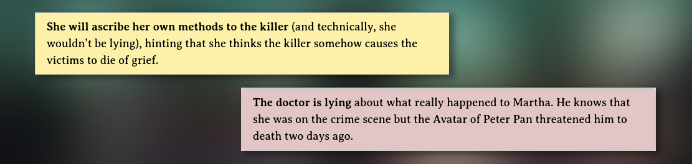

As City of Mist is, by essence, an investigation game, clues are crucial when
writing cases. Brumes enables the MC to easily add clue blocks in two different
styles.

- **Single case clues** (yellow) are relevant to the currently played case. They
  are focused on short-term gameplay elements.
- **Long-term clues** (red) are used to hide clues for the bigger picture. They
  are especially useful when writing a whole series of cases that are somehow
  linked to each other.

Brumes makes use of
[callouts](https://help.obsidian.md/Editing+and+formatting/Callouts) to design
clues. Use the `clue` type identifier for single case clues and the
`special-clue` type identifier for long-term clues.

```md
> [!clue] **She will ascribe her own methods to the killer** (and technically,
> she wouldn’t be lying), hinting that she thinks the killer somehow causes the
> victims to die of grief.
```

```md
> [!special-clue] **The doctor is lying** about what really happened to Martha.
> He knows that she was at the crime scene, but the Avatar of Peter Pan
> threatened him to death two days ago.
```

## Templater

You can use Templater to facilitate the creation of new [clues](/features/clue),
[special clues](/features/clue), [moves](/features/move) and
[descriptions](/features/description). Create a new note called
`Clue, Move & Description` in your templates folder and paste the following
code:

```js
<%*
selection = tp.file.selection();
const type = await tp.system.suggester(["Clue","Special Clue","Move","Description"], ["clue","special-clue","move","description"]);

if (type === undefined || type === null) {
	return;
} else {
	return ">[!" + type + "] " + selection;
}
%>
```
