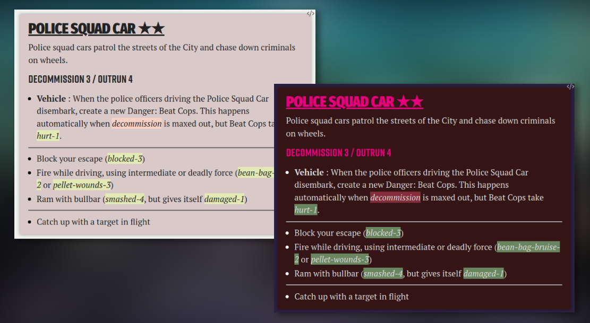

Most of the tense scenes in City of Mist involve one or more dangers. Brumes
enables you to create custom Danger blocks using the following HTML code:

```html
<div class="danger bg0">
  <h3>Danger Name ★★★</h3>
  <p>Description of the danger</p>
  <h4>Spectrum 2 / Spectrum 5</h4>
  <ul>
    <li><b>Custom Move</b>: Description of the custom move.</li>
    <li><b>Custom Move</b>: Description of the custom move.</li>
  </ul>
  <hr />
  <ul>
    <li>Hard move description</li>
  </ul>
  <hr />
  <ul>
    <li>Soft move description</li>
  </ul>
</div>
```

:::note

There are 8 background colors available for dangers. Simply pick one of the
eight corresponding HTML classes at the top of the block: `bg0`, `bg1`, `bg2`,
`bg3`, `bg4`, `bg5`, `bg6` or `bg7`.

:::

## Templater

You can also add the following template to [Templater](#templater). Add a new
note named `Danger` to your templates folder. Then copy and paste this code:

```js
<%*
selection = tp.file.selection();
let min = 0;
let max = 7;
let background = Math.floor(Math.random() * (max - min + 1) + min);
return(`
<div class='danger bg${background}'>
	<h3>${selection} ★★★</h3>
	<p>Description of the danger</p>
	<h4>Spectrum 2 / Spectrum 5</h4>
	<ul>
		<li><b>Custom Move</b>: Description of the custom move.</li>
		<li><b>Custom Move</b>: Description of the custom move.</li>
	</ul>
	<hr>
	<ul>
		<li>Hard move description</li>
	</ul>
	<hr>
	<ul>
		<li>Soft move description</li>
	</ul>
</div>
`);
%>
```
