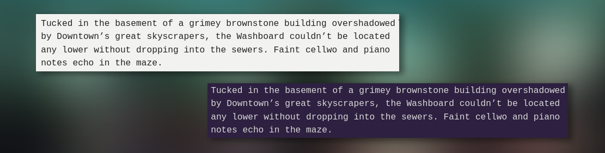

If you need to prepare some paragraphs to read aloud when your players enter a
specific location, or if you need to write beforehand the voiceover that will
start the next session, you can use a description block.

Brumes uses the custom
[callout](https://help.obsidian.md/Editing+and+formatting/Callouts) type
identifier `description` to create such blocks in Markdown.

```md
> [!description] Tucked in the basement of a grimey brownstone building
> overshadowed by Downtown’s great skyscrapers, the Washboard couldn’t be
> located any lower without dropping into the sewers. Faint cello and piano
> notes echo in the maze.
```

## Templater

You can use Templater to facilitate the creation of new [clues](/features/clue),
[special clues](/features/clue), [moves](/features/move) and
[descriptions](/features/description). Create a new note called
`Clue, Move & Description` in your templates folder and paste the following
code:

```js
<%*
selection = tp.file.selection();
const type = await tp.system.suggester(["Clue","Special Clue","Move","Description"], ["clue","special-clue","move","description"]);

if (type === undefined || type === null) {
	return;
} else {
	return ">[!" + type + "] " + selection;
}
%>
```
