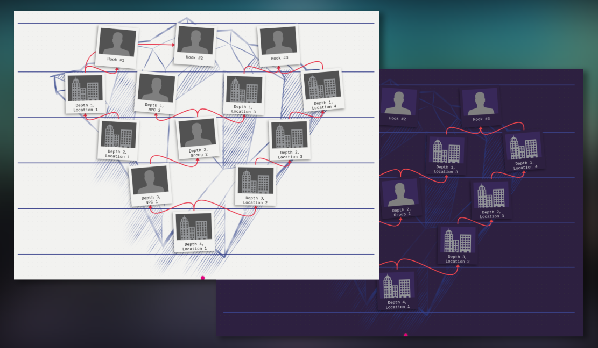
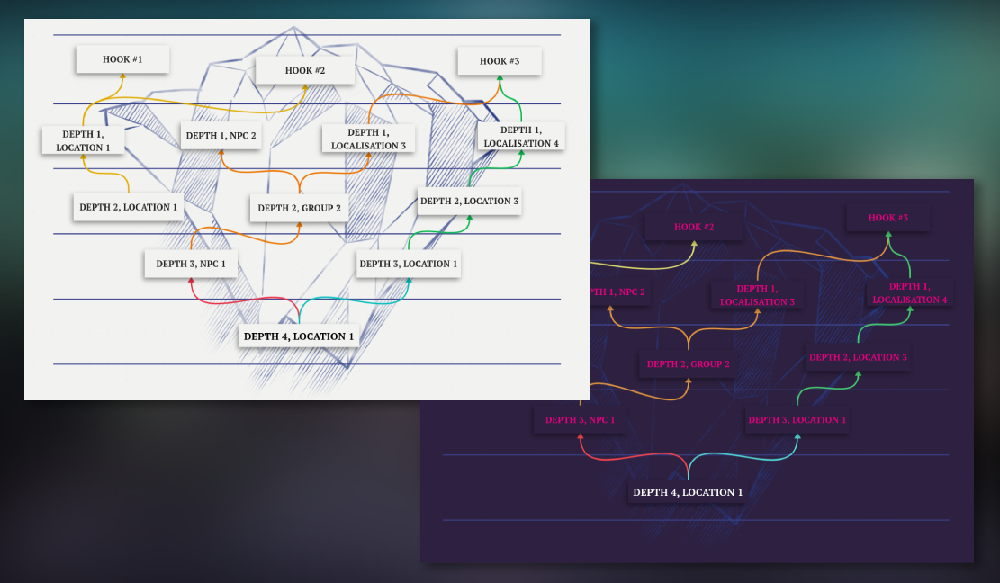

As explained in the
[MC Toolkit](https://cityofmist.co/en-eu/products/mc-toolkit), City of Mist uses
the iceberg method to create cases and organizations. Brumes would not be
complete if it did not enable the MC to create such icebergs right inside
Obsidian.

Brumes takes advantage of the [canvas](https://obsidian.md/canvas) feature of
Obsidian to create such icebergs.

:::caution

Please note that this feature uses the Canvas CSS Class plugin. If you are not
using the boilerplate vault from the
[Quick Start Guide](/start-here/getting-started), make sure you installed and
enabled this plugin. You can check the
[Manual Installation Guide](/start-here/manual-installation/#canvas-css-class)
to get some help in the process.

:::

## Setup

Create a new canvas wherever you want inside your vault. Open the command prompt
(`Ctrl+P`) and find the
`Canvas CSS class: Add a CSS Class to the active canvas`. The required class for
the theme to be applied is `iceberg`.

:::danger

If you ever rename or move the iceberg canvas afterwards, you will need to
repeat this process once more. Do not forget to go to
`Settings -> Canvas CSS class` to remove the obsolete class.

:::

## Background

Choose an iceberg background that fits your case / organization (do not worry,
you will be able to change afterwards if needed):

- [Flat Case](https://github.com/4rtamis/obsidian-brumes/tree/master/doc/iceberg_backgrounds/iceberg_flat_case.png)
  (2 depths)
- [Simple Case](https://github.com/4rtamis/obsidian-brumes/tree/master/doc/iceberg_backgrounds/iceberg_simple_case.png)
  (3 depths)
- [Average Case](https://github.com/4rtamis/obsidian-brumes/tree/master/doc/iceberg_backgrounds/iceberg_average_case.png)
  (4 depths)
- [Involved Case](https://github.com/4rtamis/obsidian-brumes/tree/master/doc/iceberg_backgrounds/iceberg_involved_case.png)
  (5 depths)
- [Blank Iceberg](https://github.com/4rtamis/obsidian-brumes/tree/master/doc/iceberg_backgrounds/iceberg_blank.png)
  (no lines)

Import the chosen background into your vault. In your canvas, right-click and
select `Create Group`. Use the toolbar to add the iceberg as a background to the
group. Resize it until you like the look of it.

## Cards

It is now time to fill your iceberg with the NPCs and locations of your case /
organization. First, you need to choose which style of iceberg you prefer.
Brumes enables the MC to create an iceberg using two cards styles:

- cards that look almost exactly like the ones in the MC Toolkit (go to
  [MC Toolkit Cards](#mc-toolkit-cards)) ;
- simplified cards optimized for readability but further away from City of Mist
  style (go to [Simple Cards](#simple-cards)).

### MC Toolkit Cards

First of all, you need to import those two SVGs somewhere your vault (in an
`assets` folder for instance):

- [Location card illustration](https://github.com/4rtamis/obsidian-brumes/tree/master/doc/iceberg_cards/iceberg-location.svg)
- [Group / NPC card illustration](https://github.com/4rtamis/obsidian-brumes/tree/master/doc/iceberg_cards/iceberg-group.svg)

Right-click on the canvas and select `Add card`. Then copy and paste the
following markdown inside your card:

```txt "INSERT CARD NAME" "X"
---
cssclass: iceberg-card rotX
---
![[iceberg-location.svg]]
[[INSERT CARD NAME]]
```

- The `iceberg-card` class enables Brumes to apply the correct styling to your
  card. Do not remove it.
- The `rotX` class modifies the rotation of the card. You can replace the `X`
  with any value between -5 and 5 (ex: `rot4`, `rot-1`, etc.).
- Change the image name depending on the type of card you want, either
  `![[iceberg-location.svg]]` for locations or `![[iceberg-group.svg]]` for an
  NPC / group.
- Change the card name according to your needs. The template uses an
  [internal link](https://help.obsidian.md/Linking+notes+and+files/Internal+links)
  for the name, but it is optional.

Once the card is not in editor mode, you should be able to resize it to a
square-like card. Resize the background group so it all fits in shapes and
sizes.

For the next cards, simply copy and paste the first one. When creating
connections between cards, you can change their colors to red to fit the overall
theme.

### Simple Cards

These cards are optimized for readability and make the most of the canvas
feature of Obsidian.

Right click on the canvas and select `Add card`. Use the very first line to
write the name of your card using a level 5 title:

```md
##### Insert Title Here
```

Optionally, you can use
[internal link](https://help.obsidian.md/Linking+notes+and+files/Internal+links)
to reference other notes in your vault:

```md
##### [[Insert Title Here]]
```

Connect the cards using the canvas built-in feature. I advise using different
colors to represent the different branches of the iceberg. You can also edit the
background color of your cards.
