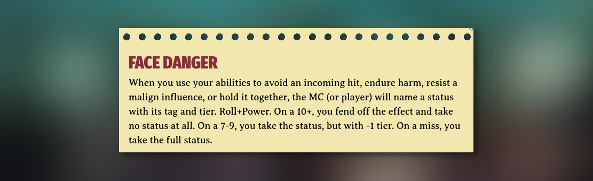

If needed, the MC can create **custom moves**, specific to a situation or a
character. Brumes enables you to format those moves using a
[callout](https://help.obsidian.md/Editing+and+formatting/Callouts) with the
type identifier `move`.

```md
> [!move] Face Danger When you use your abilities to avoid an incoming hit,
> endure harm, resist a malign influence, or hold it together, the MC (or
> player) will name a status with its tag and tier. Roll+Power. On a 10+, you
> fend off the effect and take no status at all. On a 7-9, you take the status,
> but with -1 tier. On a miss, you take the full status.
```

## Templater

You can use Templater to facilitate the creation of new [clues](/features/clue),
[special clues](/features/clue), [moves](/features/move) and
[descriptions](/features/description). Create a new note called
`Clue, Move & Description` in your templates folder and paste the following
code:

```js
<%*
selection = tp.file.selection();
const type = await tp.system.suggester(["Clue","Special Clue","Move","Description"], ["clue","special-clue","move","description"]);

if (type === undefined || type === null) {
	return;
} else {
	return ">[!" + type + "] " + selection;
}
%>
```
