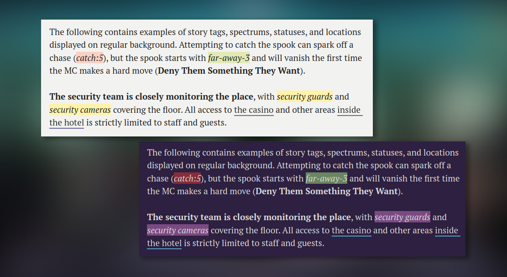

Brumes enables you to add tags, statuses and spectrums to your Obsidian notes.
Use the following HTML blocks whenever you need them:

```html
<mark class="tag">security guards</mark>
<mark class="status">far-away-3</mark>
<mark class="spectrum">catch:5</mark>
```

## Templater

To facilitate the writing process, you can make use of [Templater](#templater).
Inside your templates folder in your vault, create a new note named
`Tag, Status & Spectrum`. Then, copy and paste the following code:

```js
<%*
selection = tp.file.selection();
const type = await tp.system.suggester(["Tag","Status","Spectrum"], ["tag","status","spectrum"]);

if (type === undefined || type === null) {
	return;
} else {
	return "<mark class='" + type + "'>" + selection + "</mark>";
}
%>
```
