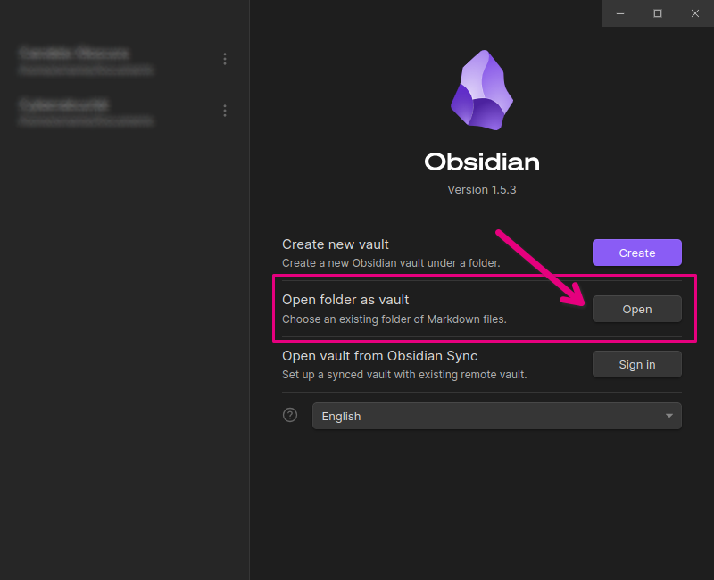
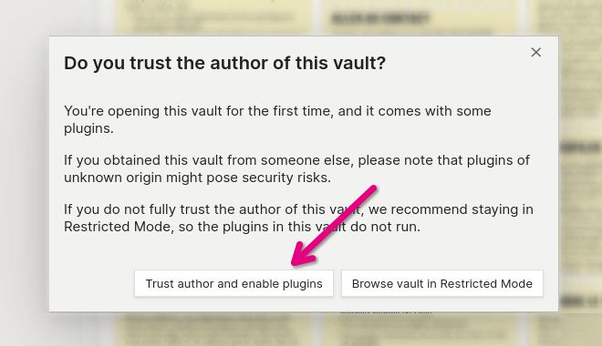

import { LinkCard } from "@astrojs/starlight/components";
import { Tabs, TabItem } from "@astrojs/starlight/components";
import { Code } from "@astrojs/starlight/components";

export const BOILERPLATE_HASH = import.meta.env.BOILERPLATE_HASH;

Brumes is an [Obsidian](https://obsidian.md) theme based on the award-winning
tabletop role-playing game [City of Mist](https://cityofmist.co/). It aims to
imitate the overall style of the City of Mist rulebooks and to provide
easy-to-use features for the MC to easily prepare her cases.

Wether you're already familiar with Obsidian or not, start using Brumes in a few
minutes using the [Quick Start Guide](#quick-start). If you already have some
experience with Obsidian and want to install Brumes in an existing vault, you
can also check out the [Manual Installation Guide](#manual-installation) for a
more customizable experience.

## Quick Start

#### Prerequisites

- **Obsidian 1.4.0 or higher**: you can download Obsidian from the
  [official website](https://help.obsidian.md/Getting+started/Download+and+install+Obsidian),
- and that's it!

:::note

Brumes embeds all the needed assets and fonts. However, the **Rift Bold** font
used in the official City of Mist books is not under a license compatible with
open source projects. In this theme, **Rift Bold** is replaced with **Bebas
Kai**. If you want to use **Rift Bold** nonetheless, you need to install it on
your system separately (follow this
[link](https://www.dafontfree.co/rift-font-family-free/)). Brumes will
automatically detect **Rift** and use it instead of the embedded font.

:::

### Download Brumes boilerplate vault

Brumes comes with a boilerplate vault which is basically a small functionnal
template with everything you need to use Obsidian with Brumes directly out of
the box.

<LinkCard
  title="Download Brumes boilerplate vault"
  description="Click here to download Brumes boilerplate vault and start using Brumes!"
  href="#"
/>

:::caution

You may want to check that you have downloaded the official Brumes boilerplate
vault. For security purposes, here is the SHA256 checksum of the latest release
of the archive.

<Tabs>
  <TabItem label="Windows">
    <ol>
      <li>Go to the folder where you have downloaded `brumes-boilerplate-vault.zip`</li>
      <li>Right-click in an empty space in the file explorer</li>
      <li>Click on **Open in Windows Terminal**</li>
      <li>
        Paste the following command in the terminal window:
        <Code code={`CertUtil -hashfile "./brumes-boilerplate-vault.zip" SHA256 | findstr /v "hash" | findstr "${BOILERPLATE_HASH}" && echo Checksum validated successfully || echo Checksum validation failed`} lang="cmd" />
      </li>
    </ol>

  </TabItem>
  <TabItem label="Linux">
    Move to the directory where you have downloaded `brumes-boilerplate-vault.zip` and run the following command in a shell:
    <Code code={`echo "${BOILERPLATE_HASH}  brumes-boilerplate-vault.zip" | sha256sum -c --status && echo "Checksum validated successfully" || echo "Checksum validation failed"
`} lang="bash" />
  </TabItem>
  <TabItem label="Mac">
    Open the terminal, go to the directory where you have downloaded `brumes-boilerplate-vault.zip` (using the `cd` command), and run the following command:
    <Code code={`echo "${BOILERPLATE_HASH}  brumes-boilerplate-vault.zip" | shasum -a 256 -c && echo "Checksum validated successfully" || echo "Checksum validation failed"
`} lang="bash" />
  </TabItem>
</Tabs>

:::

### Extract the archive

<Tabs>
  <TabItem label="Windows">
    <ol>
      <li>Right-click the folder</li>
      <li>Select **Extract All**</li>
      <li>Select a destination folder where to extract the files</li>
      <li>Click **Extract**</li>
    </ol>
  </TabItem>
  <TabItem label="Linux">
    You can simply run the `unzip` command:

    ```bash

    unzip brumes-boilerplate-vault.zip -d /path/to/directory

    ```

  </TabItem>
  <TabItem label="Mac">
    Simply double-click on the archive and it will extract it in the same folder.
  </TabItem>
</Tabs>

The folder `Brumes Boilerplate Vault` contains the whole vault, with all the
template notes and Brumes already configured : move it wherever you want in your
file system. You can then rename this folder with the name you want (ex. the
name of your crew or the name of your series).

### Open the vault with Obsidian

Open Obsidian and from the startup window, click on the open button of the
**Open folder as vault** section, then select the Brumes boilerplate vault
folder (that you may have renamed) you've just extracted.



Obsidian should display a warning and ask you if you want to "Trust the author
of this vault". This message pops-up because the vault already contains Brumes
and some community plugins for it to run effectively. Click on **Trust author
and enable plugins**.



### Next steps

That's it! You can now play around with the boilerplate vault. Copy and paste
the blocks you want directly from the existing notes and start writing your next
case! If you want to get a more detailed overview of what Brumes can do, check
out our [Feature Guide](/features).

<LinkCard
  title="Feature Guide"
  description="Click here to discover everything Brumes can do!"
  href="/features"
/>
