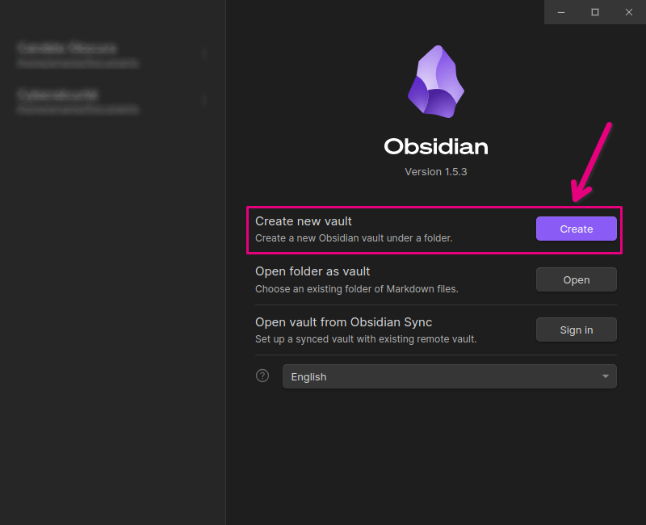
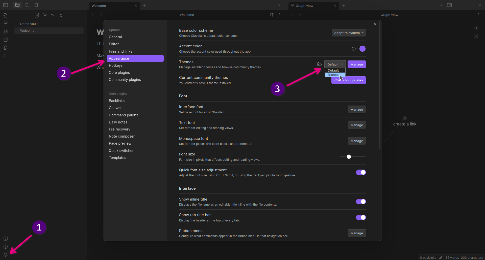
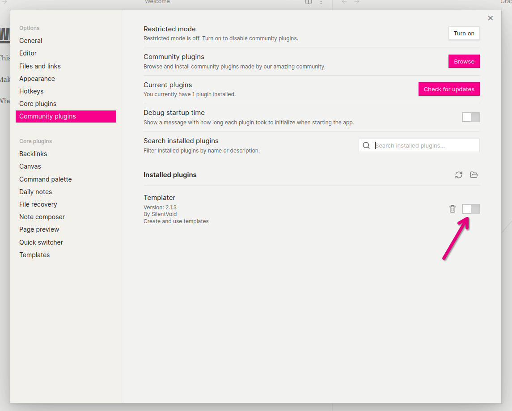
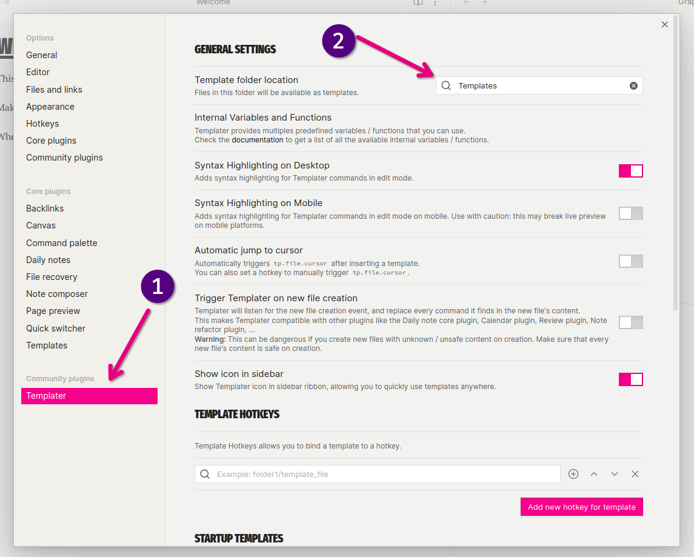
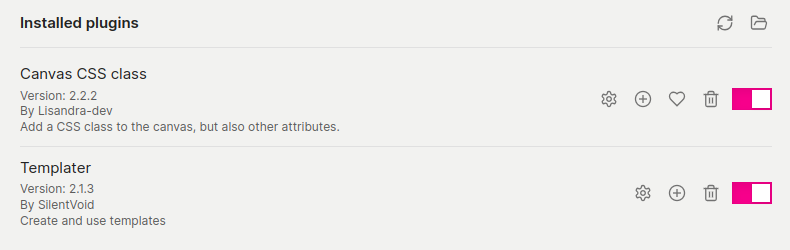

import { LinkCard } from "@astrojs/starlight/components";
import { Tabs, TabItem } from "@astrojs/starlight/components";
import { Code } from "@astrojs/starlight/components";

import KBD from "../../../components/KBD.astro";

At its core, Brumes is only an Obsidian theme. However, in order to fully
experience everything Brumes has to offer, some companion plugins are to be
installed alongside Brumes. This guide will help you through the whole setup
process in Obsidian.

## Theme Installation

Brumes can be installed either in a whole new vault or in an existing one. Skip
the first step if you already have an existing vault.

### Create a new Obsidian vault (Optional)

Launch Obsidian and create a new vault from the startup window.



### Find the `.obsidian` folder in your vault

In your file explorer, find the root folder of the vault in which you want to
install Brumes (ex. the folder you selected when you created the vault). In this
folder, you should see another folder called `.obsidian`. If you do not see this
folder, follow the steps below:

<Tabs>
  <TabItem label="Windows">
    **Windows 11**: From the File Explorer, select **View** > **Show** > **Hidden items**.

    **Windows 10**: From the File Explorer, select **View** > **Options** > **Change folder and search options**. Then select the **View** tab and, in the **Advanced settings** section, select **Show hidden files, folders, and drives** before clicking on **OK**.

  </TabItem>
  <TabItem label="Linux">
    This is highly dependant on your desktop environment. Use preferably a shell and display hidden files and folders using `ls -la`.
  </TabItem>
  <TabItem label="Mac">
    In the Finder, press <KBD body="Ctrl" /> + <KBD body="Shift" /> + <KBD body="." /> to toggle the visibility of hidden files and folders.
  </TabItem>
</Tabs>

### Download and add Brumes to your vault

Download two files from the latest release of Brumes : `theme.css` and
`manifest.json`.

<LinkCard
  title="Latest Release"
  description="Click here to download the latest release of Brumes."
  href="https://github.com/4rtamis/obsidian-brumes/releases"
/>

Then go back to your vault folder.

1. Create a new `themes` folder inside the `.obsidian` folder.
2. Create a new `Brumes` folder inside the `themes` folder.

Then move `theme.css` and `manifest.json` inside the newly created `Brumes`
folder. Your vault structure should look like this now:

```txt {3-6}

Your vault name/
├── .obsidian/
│   └── themes/
│       └── Brumes/
│           ├── manifest.json
│           └── theme.css
└── [...]

```

### Select Brumes in Obsidian settings

1. Back in Obsidian, click on the little cog wheel at the bottom left-hand
   corner of the interface to open the settings window.
2. Go to the **Appearance** tab.
3. Select Brumes in the **Themes** section.



## Companion Plugins Installation

The following plugins should be installed alongside Brumes:

- [Templater](https://github.com/SilentVoid13/Templater) is a community plugin
  that defines a powerful templating language right inside Obsidian. It is used
  to facilitate the creation of **dangers**, **tags**, **statuses** and
  **spectrums**.
- [Canvas CSS Class](https://github.com/Lisandra-dev/obsidian-canvas-css-class)
  is a community plugin that can add CSS classes to canvas. It is especially
  useful to create **Icebergs**.

### Templater

You can install Templater via the Community Plugins tab within Obsidian.

Go to **Settings** > **Community plugins** > **Browse** (you might need to turn
off "Restricted mode"). Simply search for "Templater" and install it. Do not
forget to enable the plugin once installed.



Then, in your note tree directly in Obsidian, create an empty folder called
"Templates" (or any name that seems appropriate). This folder will contain all
the templates you will add in order to facilitate the creation of _tags_,
_status_, _dangers_...

Open once more the settings window and go to the **Templater** tag at the bottom
of the list. In the **Template folder location** section, select the folder
you've just created.



:::caution

If you ever move, rename or delete this folder, Templater will not be able to
locate your templates anymore. You will need to indicate your new template
folder in the settings of Templater.

:::

### Canvas CSS Class

You can install Canvas CSS Class via the Community Plugins tab within Obsidian.

Like before, go to **Settings** > **Community plugins** > **Browse**. Simply
search for "Canvas CSS Class" and install it. Do not forget to enable the plugin
once installed.



## Next steps

That's it! You are now ready to start working using Brumes. If you want to get a
more detailed overview of what Brumes can do, check out our
[Feature Guide](/features).

<LinkCard
  title="Feature Guide"
  description="Click here to discover everything Brumes can do!"
  href="/features"
/>

:::caution

Please note that we only installed Templater. We did not create the templates
that enable you to quickly add _tags_, _status_, _dangers_ and so on... In order
to create these templates, please refer to the [Feature Guide](/features) or
check out the [Quick Start Guide](#quick-start) whose boilerplate vault contains
the base templates.

:::
